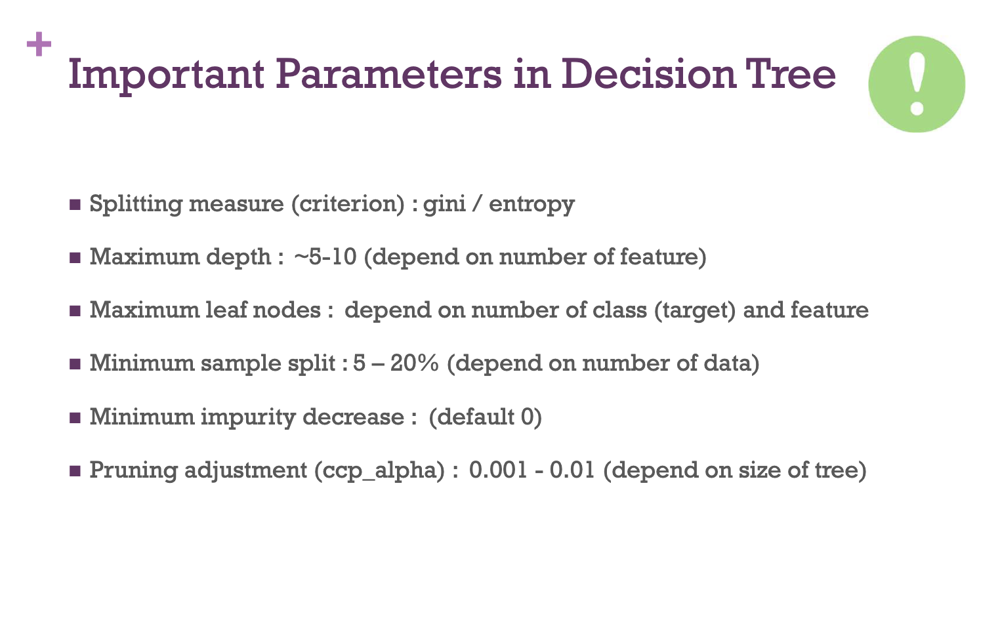
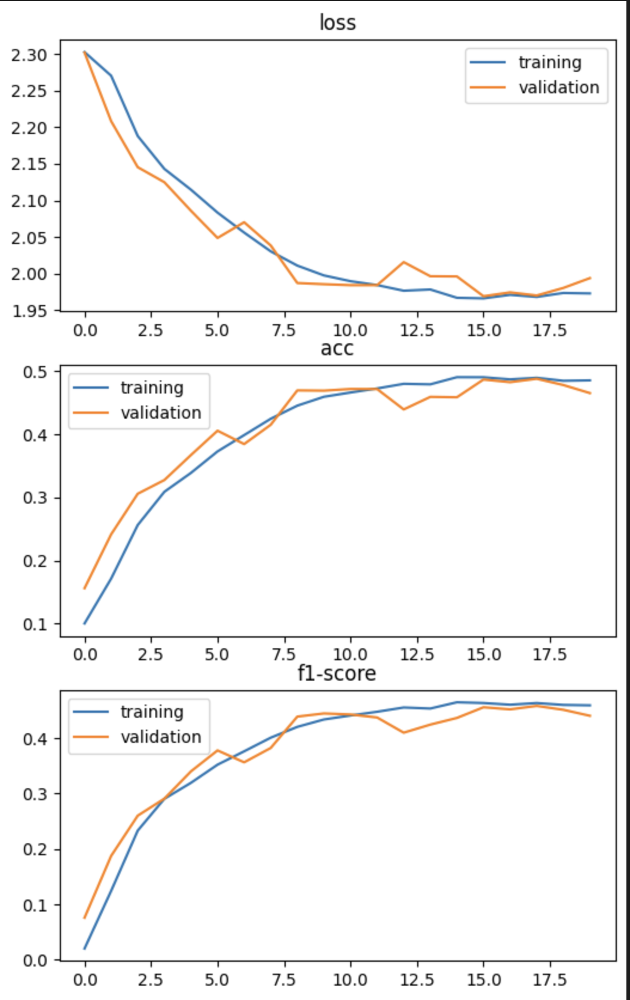
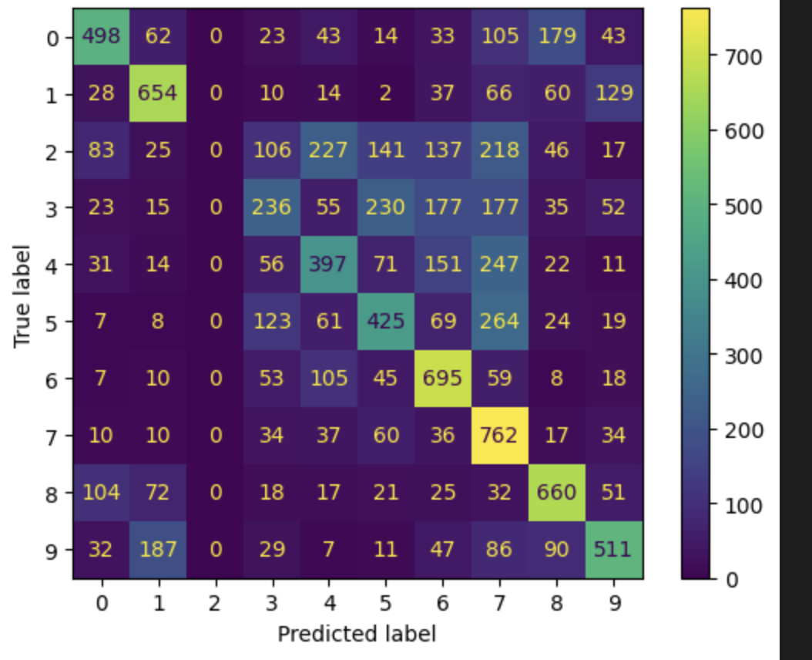
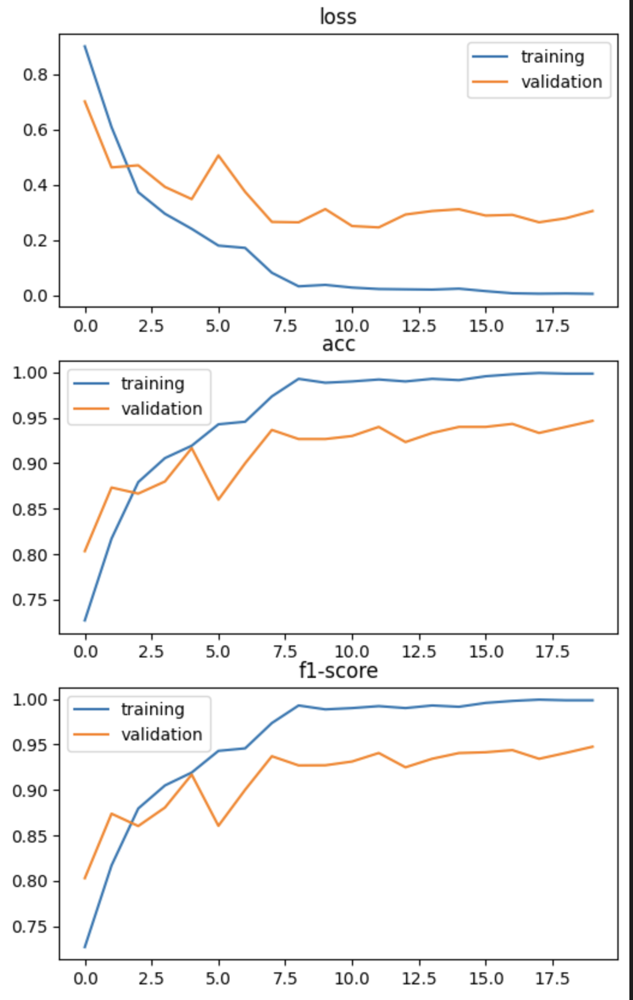
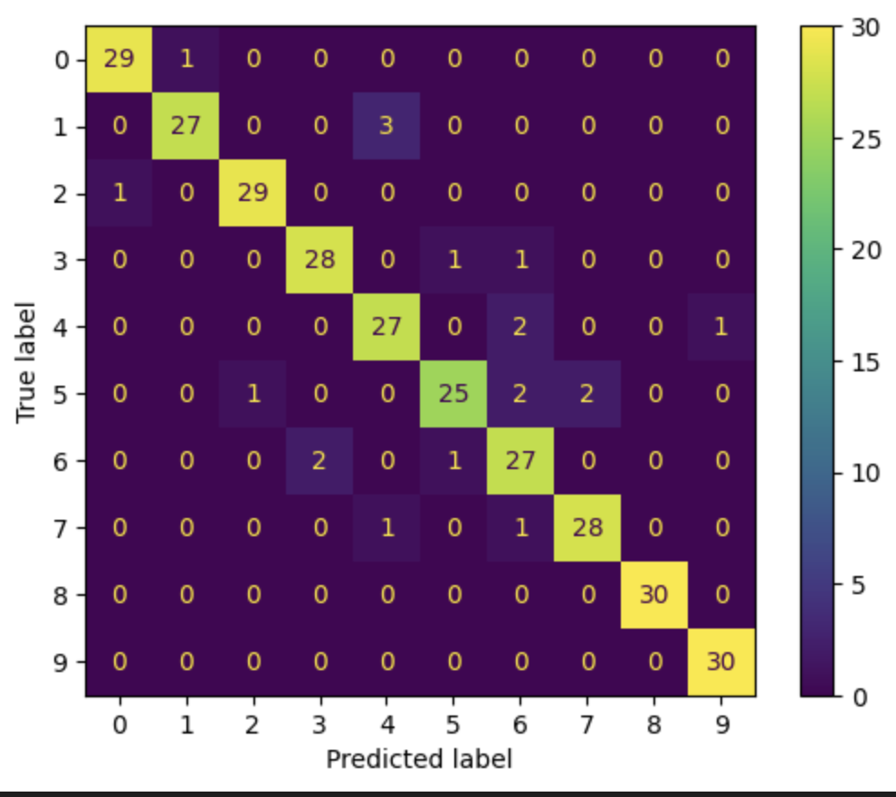
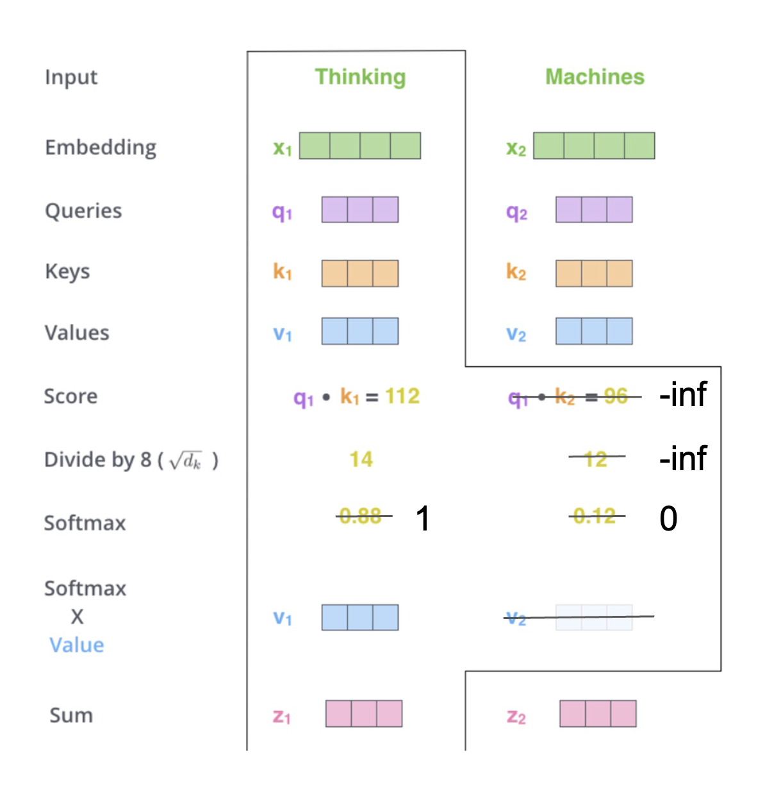
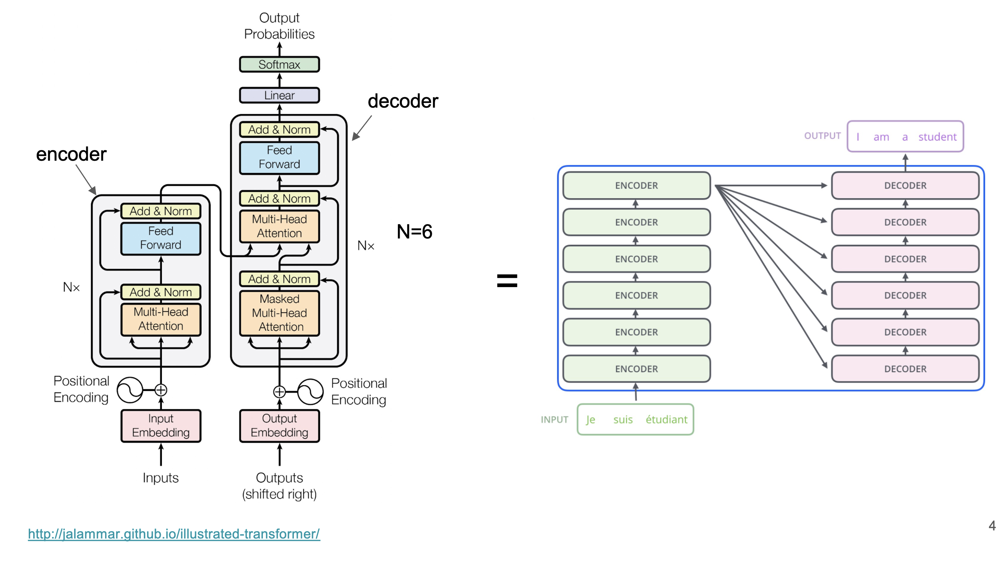

# 2110446-DS-and-DE
code in DS and DE class 

- [2110446-DS-and-DE](#2110446-ds-and-de)
  - [Acknowledgement](#acknowledgement)
  - [Table of Contents](#table-of-contents)
  - [1st week](#1st-week)
    - [key pandas command](#key-pandas-command)
    - [Assignment 1](#assignment-1)
  - [2nd week](#2nd-week)
  - [Week 3](#week-3)
    - [AI](#ai)
    - [Supervise learning (Predictive task)](#supervise-learning-predictive-task)
      - [Type of problem](#type-of-problem)
    - [Unsupervise learning](#unsupervise-learning)
    - [Impurity reduction](#impurity-reduction)
    - [Tree visualization](#tree-visualization)
    - [Regularization](#regularization)
    - [Dicision tree classifier](#dicision-tree-classifier)
    - [Bagging ( Bootstrap Aggregation )](#bagging--bootstrap-aggregation-)
    - [Boosting](#boosting)
    - [Random forest classifier](#random-forest-classifier)
      - [hyperparameters](#hyperparameters)
    - [Feature selection from tree (feature importance) with shortcut](#feature-selection-from-tree-feature-importance-with-shortcut)
    - [Linear regression](#linear-regression)
  - [Week 4](#week-4)
    - [kNNs](#knns)
      - [Caution](#caution)
    - [GridSearchCV](#gridsearchcv)
    - [RandomizeSearchCV](#randomizesearchcv)
    - [Save \& Load model](#save--load-model)
    - [Pipelining](#pipelining)
    - [Neural Network](#neural-network)
      - [Weight updating](#weight-updating)
    - [CNN](#cnn)
      - [example](#example)
    - [Use case](#use-case)
      - [Image classification (via CNN)](#image-classification-via-cnn)
        - [Setup](#setup)
        - [Model arch.](#model-arch)
        - [Training](#training)
        - [Training result](#training-result)
        - [Metrics](#metrics)
        - [Evaluation (confusion matrix)](#evaluation-confusion-matrix)
      - [Text classification (via EfficientNet V2 S)](#text-classification-via-efficientnet-v2-s)
        - [Setup](#setup-1)
        - [Model arch.](#model-arch-1)
        - [Training](#training-1)
        - [Training result](#training-result-1)
        - [Metrics](#metrics-1)
        - [Evaluation (confusion matrix)](#evaluation-confusion-matrix-1)
  - [Week 5](#week-5)
    - [Image task](#image-task)
    - [Model explanation](#model-explanation)
    - [RNN (Recurrent Nueral Network)](#rnn-recurrent-nueral-network)
      - [LSTM (Long-short term memory)](#lstm-long-short-term-memory)
    - [GRU (Gated Recurrent Nueral Network)](#gru-gated-recurrent-nueral-network)
    - [Attention](#attention)
    - [Transformer](#transformer)
      - [Adapt to Image field -\> ViT (Visual Transformer)](#adapt-to-image-field---vit-visual-transformer)
      - [When to use which](#when-to-use-which)
      - [Oil and Gold](#oil-and-gold)
    - [Model monitoring](#model-monitoring)
      - [ML Flow (logging and monitoring)](#ml-flow-logging-and-monitoring)
    - [Exam](#exam)
  - [Reference](#reference)


## Acknowledgement
- the folder `example_code` and `example_slide` is from the class github(referred in [Reference](#reference))
- all assignment is from the class github(referred in [Reference](#reference))

## Table of Contents
- [2110446-DS-and-DE](#2110446-ds-and-de)
  - [Acknowledgement](#acknowledgement)
  - [Table of Contents](#table-of-contents)
  - [1st week](#1st-week)
    - [key pandas command](#key-pandas-command)
    - [Assignment 1](#assignment-1)
  - [2nd week](#2nd-week)
  - [Week 3](#week-3)
    - [AI](#ai)
    - [Supervise learning (Predictive task)](#supervise-learning-predictive-task)
      - [Type of problem](#type-of-problem)
    - [Unsupervise learning](#unsupervise-learning)
    - [Impurity reduction](#impurity-reduction)
    - [Tree visualization](#tree-visualization)
    - [Regularization](#regularization)
    - [Dicision tree classifier](#dicision-tree-classifier)
    - [Bagging ( Bootstrap Aggregation )](#bagging--bootstrap-aggregation-)
    - [Boosting](#boosting)
    - [Random forest classifier](#random-forest-classifier)
      - [hyperparameters](#hyperparameters)
    - [Feature selection from tree (feature importance) with shortcut](#feature-selection-from-tree-feature-importance-with-shortcut)
    - [Linear regression](#linear-regression)
  - [Week 4](#week-4)
    - [kNNs](#knns)
      - [Caution](#caution)
    - [GridSearchCV](#gridsearchcv)
    - [RandomizeSearchCV](#randomizesearchcv)
    - [Save \& Load model](#save--load-model)
    - [Pipelining](#pipelining)
    - [Neural Network](#neural-network)
      - [Weight updating](#weight-updating)
    - [CNN](#cnn)
      - [example](#example)
    - [Use case](#use-case)
      - [Image classification (via CNN)](#image-classification-via-cnn)
        - [Setup](#setup)
        - [Model arch.](#model-arch)
        - [Training](#training)
        - [Training result](#training-result)
        - [Metrics](#metrics)
        - [Evaluation (confusion matrix)](#evaluation-confusion-matrix)
      - [Text classification (via EfficientNet V2 S)](#text-classification-via-efficientnet-v2-s)
        - [Setup](#setup-1)
        - [Model arch.](#model-arch-1)
        - [Training](#training-1)
        - [Training result](#training-result-1)
        - [Metrics](#metrics-1)
        - [Evaluation (confusion matrix)](#evaluation-confusion-matrix-1)
  - [Week 5](#week-5)
    - [Image task](#image-task)
    - [Model explanation](#model-explanation)
    - [RNN (Recurrent Nueral Network)](#rnn-recurrent-nueral-network)
      - [LSTM (Long-short term memory)](#lstm-long-short-term-memory)
    - [GRU (Gated Recurrent Nueral Network)](#gru-gated-recurrent-nueral-network)
    - [Attention](#attention)
    - [Transformer](#transformer)
      - [Adapt to Image field -\> ViT (Visual Transformer)](#adapt-to-image-field---vit-visual-transformer)
      - [When to use which](#when-to-use-which)
      - [Oil and Gold](#oil-and-gold)
    - [Model monitoring](#model-monitoring)
      - [ML Flow (logging and monitoring)](#ml-flow-logging-and-monitoring)
    - [Exam](#exam)
  - [Reference](#reference)

## 1st week
### key pandas command
```python
# pandas command

## from 3rd python notebook
map(...)
apply(...)
cut(...)
unique(...)
filter(...)
### key datetme transformation

## from 4th python notebook
file.json(...)
df.merge(...)
```

### Assignment 1
link [here](/assignment_1/5_PandasAssignment.ipynb)

## 2nd week
interest command
```python
import pandas as pd
df = pd.read_csv(...)

# drop row/column
df.dropna(tresh=x) # drop which value not fit treashold
df.drop(columns=[...])

'''
axis 0=row, 1=column
'''

# count by values
df[...].value_counts()

# count Null/None value
df.isnull().sum()

# mapping dict
md = {
    col_name1 : {
        from1 : to1,
        from2 : to2,
        ...
    }
    col_name2 : {...}
}
df.replace(md, inplace=True)

# One-hot encoding
dummied_df = pd.get_dummies(df[col_name], drop_first=...)
#   or use scikit-learn (better)
from sklearn.preprocessing import OneHotEncoder
oh_enc = OneHotEncoder(drop='first')
oh_enc.fit(X)
#   can use with both train and test but use parameter that fitted

# impute missing
from sklearn.impute import SimpleImputer
num_imp = SimpleImputer(missing_value=..., strategy='mean')
num_imp.fit(X)
#   can use with both train and test but use parameter that fitted

# train/test split
#   note that y must be category so if y is numeric -> add grouping column
from sklearn.model_selection import train_test_split
X_train, X_test, y_train, y_test = train_test_split(X,
                                                    y,
                                                    stratify=y,
                                                    test_size=...,
                                                    random_state=42)

# remove outlier
from scipy import stats
#   1. mean +- 3sd (z>3 or z<-3)
z = np.abs(stats.zscore(df))

```

## Week 3

### AI 
has
1. Rule-based AI 
    - Knowledge representation
    - create **Answer** from *data* and *rule*

1. Machine learning
    - create **Rule** from *data* and *answer*
    - `scikit-learn` for traditional

### Supervise learning (Predictive task)
> learn from existed answer

the methodology
1. **Training phase**
    - give data to model

1. **Testing phase (inference)**
    - evaluate perfomance
    - use model in real problem


#### Type of problem
- Classification problem
    - target is **categorical  problem**
    - use **classifier** model
- Regression problem
    - target is **predict numeric**
    - use **regressor** model

### Unsupervise learning
> learn from only data *(no answer)*

### Impurity reduction
1. Entropy
1. Information Gain
    - $\text{Information Gain} = Entropy_{Before} - Entropy_{After}$
1. Gini impurity
    - $Gini = 1-\sum_{i}^{n}(P_i)^2$
        - $P_i$ : prob. of class i in data-set
    - $\text{Gini reduction} = Gini_{Before} - Gini_{After}$

### Tree visualization
```python
from sklearn.tree import plot_tree

plot_tree(model)
```

### Regularization
- balance between **performance** and **complexity**

### Dicision tree classifier
- make decision based on node criteria
- each leaf node represents area and % of confidense is from ratio between class

essentials
- split search *- compare impurity between before and after split* and select best purity from the split
- after get splitted area -> recursive on each area.

hyperparameters
- `max_depth` : maximum depth of the model
    - the more `max_dept`, the more **overfitting**
- `min_leaf_size` : minimum datapoints in each leaf(area)
    - the less `min_leaf_size`, the more **overfitting**

Adventage
- the model is **decribable**
- able to tell **feature importance**
    - summation of $\nabla\text{goodness}$
    - use for **variable selection**
    - `model.feature_importances_`

Be caution
1. Instability
    - very sentitive to datapoints. model change with a little noise

Pruning
- $ R_\alpha (T) = R(T) + \alpha|T|$
- use $\alpha$ to regularization the three
- the more $\alpha$, the smaller tree
- $\alpha$ is `ccp_alphas` in `sklearn.tree` but default is **0**



### Bagging ( Bootstrap Aggregation )
> random with replacement

1. random subset 
    - each subset can be overlapping
1. use subset to train model ( get more model )
1. use each model to help predict together

### Boosting
> onvert **waek learner** to **stronger one**

- in each step, we boost freq. the wrong case of the previous tree.
- do any step until we accept the perfomance

e.g. `AdaBoosting`, `XGBoost`, etc.

### Random forest classifier
> random without replacement

1. random subset
    - all subset must not overlapped both data and features
1. do like normal tree

hyperparameters
1. `max_sample` 
1. `max_featurea`
1. `n_estimators`

#### hyperparameters
1. #Tree
1. #Columns (features)
1. #Rows (example)

### Feature selection from tree (feature importance) with shortcut
```python
from sklearn.feature_selection import SelectFromModel

model = ...
selector = SelectFromModel(model)
selector = select.fit(X, y)
selector.get_support()
```
### Linear regression
assumption
1. **linear relationship** between feature and target
1. error are **independent** from each other
1. target distribution is normal **(no outlier)**
    - error are normally distributed
    - error have constant variance

Regularization
- Idea : $\text{Loss} = \text{Error} + \lambda\text{Complexity}$
- L1 : Lasso
    - **absolutely**
    - $ \text{Loss} = \sum_{i=1}^{n}(y_i - \hat{y_i})^2 + \lambda\sum_{j=1}^{p}|\beta_j|$
- L2 : Ridge
    - **square**
    - $ \text{Loss} = \sum_{i=1}^{n}(y_i - \hat{y_i})^2 + \lambda\sum_{j=1}^{p}\beta_j^2$

Sklean example
    
```python
from sklearn.linear_model import Lasso, Ridge, ElasticNet

model = Lasso(alpha=...)

model = Ridge(alpha=...)

model = ElasticNet(alpha=..., l1_ratio=...) # l1_ratio = 0 -> Ridge, l1_ratio = 1 -> Lasso
```

Basic solution
- if not linear -> use **Neural Network**
- if not normal -> take log to make it ***more*** normal

## Week 4

### kNNs
- `k` : number of nearest neighbors -> to make **vote/average/miximum prob, etc.**
- `distance_fn` : to measure distance

#### Caution
1. must be **numeric** value
1. must **normalize** data on each axis

### GridSearchCV

```python
from sklearn.model_selection import GridSearchCV
from sklearn.model_selection import StratifiedKFold

grid_search = GridSearchCV(estimator=...,
                           param_grid=...,
                           scoring=...,
                           cv=StratifiedKFold(n_splits=5))
grid_Ssarch.fit(...)

model = grid_search.best_estimator_

model.predict(...)
```

### RandomizeSearchCV

- as same as `GridSearchCV` but randomize approach
- `n_iter` : to tell the most iteration to random select.

### Save & Load model

```python
import pickle

# to save model
pickle.dump(model, open('model.pkl', 'wb'))

# to load model
loaded_model = pickle.load(open('model.pkl', 'rb'))

loaded_model.predict(...)
```

### Pipelining

```python
from sklearn.impute import SimpleImputer
from sklearn.preprocessing import OneHotEncoder, MinMaxScaler
from sklearn.compose import ColumnTransformer, make_column_selector
from sklearn.pipeline import Pipeline

num_pl = Pipeline(steps=[('impute', SimpleImputer(strategy='mean')),
                         ('scale', StandardScaler())])

cat_pl = Pipeline(steps=[('imput', SimpleImputer(strategy='most_frequent')),
                         ('scale', OneHotEncoder())])

from sklearn.compose import ColumnTransformer

col_transf = ColumnTransformer(transformers=[('num_pl', num_pl, num_cols),
                                             ('cat_pl', cat_pl, cat_cols),
                                             n_jobs=-1], remainder='drop')

model_pl = Pipeline(steps=[('col_trans', col_trains),
                            'model', model])

# display pipeline
display(model_pl)

# to get parameters name
model_pl.get_params()
```

### Neural Network
- `hidden_units`, `hidden_layers`, `lr`, `decay`, etc.
```python
from sklearn.neural_network import MLPClassifier, MLPRegressor

# solver is equal to Optimizer
'''
for example 2 layer that has 100, 200 nodes
si hidden_layer_sizes = (100, 200)
'''
model = MLPClassifier(hidden_layer_sizes=...,
                      actication='relu',
                      solver=...)
```

#### Weight updating
1. Stochastic Gradient Descent (SGD)
    - update weight for every single iteration(each data point)
    - **note** not tolerate to outlier
1. Batch Gradient Descent 
    - train all the data and **average** gradients to calculate back prop.
1. Mini-batch Gradient Descent
    - group data into smaller batch and **average**  bra bra bra
    - **note** use less memory, tolerate to outlier.
    - aka. `batch_size`

### CNN
- kernal
    - `filter size` : size of kernel
    - `filters` : number od kernel
    - `stride` : number of pixel that kernel moved
    - `padding` : number of pixel extended
**process** convolution layer (feature extraction) -> NN -> outcomes

#### example 

1. VGGNet
    - feature extraction layer : `Conv2D(3x3)` + `Conv2D(3x3)` + `MaxPool`
1. Inception V1/ GoogLeNet
    - variant kernel size
    - **Deeper and Wider**
1. Inception V2, V3
    - more speed
    - **Factorize** metrix e.g. 5x5 kernal represented by 2 of 3x3 kernel, etc.
    - use **Batch norm** to reduce *Gradient vanishing*
1. ResNet 
    - make **Short skip connection** then each group call *residual block*, to reduce *Gradient vanishing*
1. Inception-ResNet
    - make Inception go deeper.
1. EfficientNet
    - deeper, wider, resolution (variant size of kernel) -> **compound scaling** 
1. EfficientNet V2
    - smaller and faster 6x
    - size : S, M, L, XL

### Use case

#### Image classification (via CNN)

##### Setup
- Classify image in **CIFAR 10** dataset with **CNN** model
- Use **GPU** for training 
- **Input** : image in size (32, 32, 3)
- **Output** : 10 classes (0-9)
- Batch size is 32
- from 60,000 image splited into
    1. 40,000 of train
    1. 10,000 of validation
    1. 10,000 of test

##### Model arch.
1. Conv2D (`nn.Conv2d(3, 6, 5)`)
    - input_channel = 3
    - output_channel = 6
    - kernel_size = (5, 5)
    - **parameters** = (5x5)x3x6 + 6 = 456
1. ReLU (`nn.ReLU()`)
1. MaxPool2D (`nn.MaxPool2d(2, 2)`)
    - kernal_size = (2, 2)
    - stride = 2
1. Conv2D (`nn.Conv2d(6, 16, 5)`)
    - input_channel = 6
    - output_channel = 16
    - kernel_size = (5, 5)
    - **parameters** = (5x5)x6x16 + 16 = 2,416
1. ReLU
1. MaxPool2D
    - kernal_size = (2, 2)
    - stride = 2
1. Flatten (`torch.flatten()`)
1. Dense (`nn.Linear(400, 120)`)
    - input = 400 (16x5x5)
    - output = 120
    - **parameters** = 400x120 + 120 = 48,120
1. ReLU
1. Dense (`nn.Linear(120, 84)`)
    - input = 120
    - output = 84
    - **parameters** = 120x84 + 84 = 10,164
1. ReLU
1. Dense (`nn.Linear(84, 10)`)
    - input = 84
    - output = 10
    - **parameters** = 84x10 + 10 = 850
1. Softmax (`nn.Softmax()`)

Total parameters = 456 + 2,416 + 48,120 + 10,164 + 850 = 61,006
```python
from torchinfo import summary
print(summary(model, input_size=(32, 3, 32, 32)))
```

##### Training
- Loss(criterion) : `nn.CrossEntropyLoss()`
- Optimizer : `torch.optim.SGD(model.parameters(), lr=1e-2, momentum=0.9)`
- train steps
    >Let's train!
    >For an epoch in a range
    >Call model dot train
    >Do the forward pass
    >Calculate the loss
    >Optimizer zero grad
    >Lossssss backward
    >Optimizer step step step
    >
    >Test time!
    >Call model dot eval
    >With torch inference mode
    >Do the forward pass
    >Calculate the loss
    >
    >Print out what's happenin'
    >
    >Let's do it again 'gain 'gain
    
    choose the model by **validation loss**

##### Training result


##### Metrics
```python
report = classification_report(y_labels, y_pred)

acc = report['accuracy']
prec = report['weighted avg']['precision']
rec = report['weighted avg']['recall']
f1 = report['weighted avg']['f1-score']
```
- Accuracy
    - in **prediction**, how many **correct**
- Precision
    - in **prediction**, how many correct in **positive**
- Recall
    - in **positive**, how many correct in **prediction**
- F1
    - average of precision and recall

##### Evaluation (confusion matrix)
```python
from sklearn.metrics import confusion_matrix, ConfusionMatrixDisplay

M = confusion_matrix(y_labels, y_pred)
disp = ConfusionMatrixDisplay(confusion_matrix=M)
```


####  Text classification (via EfficientNet V2 S)
##### Setup
- Classify 10 classes in Animal image dataset using EfficientNet V2 model
- Use GPU for training
- Input : image in size (224, 224, 3)
    - (230, 230) -> random rotation, clop, horizontal flip, vertical flip, nomralize -> train
    - normalize -> test
- Output : 10 classes (0-9)
- Batch size is 32
- from 2,000 image splited into
    1. 1,400 of train
    1. 300 of validation
    1. 300 of test

##### Model arch.
1. use pretrained weight from ImageNet-1000
    ```python
    import torchvision
    pretrained_weight = torchvision.models.EfficientNet_V2_S_Weights.IMAGENET1K_V1
    ```
1. use EfficientNet V2 size S
    ```python
    model = torchvision.models.efficientnet_v2_s(weights = pretrained_weight)
    model.classifier[1] = nn.Linear(1280, 10)
    model.to(device)
    ```

Total parameters = 20,190,298 

##### Training
- criterion : `nn.CrossEntropyLoss()`
- optimizer : `torch.optim.SGD(model.parameters(), lr=1e-2, momentum=0.9)`
- scheduler : `torch.optim.lr_scheduler.StepLR(optimizer, step_size=7, gamma=0.5)`

##### Training result


##### Metrics
- Accuracy
- Precision
- Recall
- F1

##### Evaluation (confusion matrix)


## Week 5

### Image task
1. classification
1. detection
1. semantic segmentation
1. panoptic segmentation
    - segmentation + object detection
### Model explanation
- `GradCAM` Technique

### RNN (Recurrent Nueral Network)
- Auto*regressive* model
- $X_t = c+\sum_i\omega X_{t-i}$
- **input**
    1. Current features ($X_t$)
    1. Previous magical number ($S_{t-1}$)
- **output**
    1. Next state value ($X_{t+1}$)
- caution
    - BPTT : Back Propogation Through Time -> **Gradient Vanishing**
ß
#### LSTM (Long-short term memory)
- avoid **Gradient Vanishing**
- 3 parts
    1. input gate : input $X_t$
    1. output gate : predict $X_{t+1}$
    1. forget gate : to make decision how much historical info. impact
- **input**
    1. $X_t$
    1. short term(last $X$), long term memory
- **output**
    1. $X_{t+1}$
    1. short term(last $X$), long term memory
### GRU (Gated Recurrent Nueral Network)
- **LSTM** which smaller
- **input**
    1. $C_{t-1}$
    1. $X_t$
- **output**
    1. $X_{t+1}$

### Attention
- **to fix** : normal RNN can't handle long output (e.g. ~1000 words to translate) b.s. *Bottle neck issue*
- **Main idea** : use all embedded vectors instead of one
    - use **Attention mechanism** -> *weighed sum* which *attention score*(learnable parameters)
        - $C_i = \sum_ja_{i,j}h_j$ which $C_i$ is context vector(like embedded vector in **RNN**)
- **type** of attention
    1. additive attention
    1. multiplication attention
    1. self-attention
        - e.g. "It's a dog" and "It's a cat", "It" is not refer to the same meaning -> we compare ourself to other again(KV attention) -> enrich meaning
        
    1. key value attention
        - Query : *what's we want to know*
        - Key : index of data
        - Value : embedded vector
        - Scale dot-product formular : $\text{Attention}(Q,V,K) = \text{Softmax}(\frac{QK^T}{\sqrt{d_k}}V)$
            - $\sqrt{d_k}$ to scale number with its *dimension*

### Transformer

- Only **Attention**, without **RNN**
- transformer-based model
    1. Decoder-based model : GPT
    1. Encoder-based model : BERT
    1. Encoder & Decoder : BART

#### Adapt to Image field -> ViT (Visual Transformer)
1. split image into smaller grid
1. feed like a word (act like describe each grid with image)
1. use transformer encoder side

#### When to use which
1. Text generation -> **GPT**
1. Text classification -> **BERT**

#### Oil and Gold
- [huggingface](http://huggingface.co/)

### Model monitoring
1. ML Flow
    - traditional ML model
1. TensorBoard
    - deep learning model
1. Weights & Biases
    - deep learning and traditional ML model
    - required **API key**

#### ML Flow (logging and monitoring)
1. installing
    ```bash
    pip install mlflow --quiet --use-deprecated=legacy-resolver 
    ```
```python

import mlflow

# start logging
local_registry = 'sqlite:///mlruns.db'
mlflow.set_tracking_uri(local_registry)
exp_id = mlflow.set_experiment('my_exp')

# logging parameter
mlflow.log_param('param1', 1)

# logging metric
mlflow.log_metric('metric1', 0.5)

# logging model
mlflow.pytorch.log_model(model, 'model')

# search run
best_model_df = mlflow.search_runs(order_by=['metrics.metric1 DESC'], max_results=5)

# get model
best_model = mlflow.pytorch.load_model(best_model_df.iloc[0].artifact_uri)

# MLflow UI
!mlflow ui
'''
access through link http://localhost:5000
'''
!pip install pyngrok --quiet

from pyngrok import ngrok
ngrok.kill()

#Setting the authtoken (optional)
#Get your authtoken from https://ngrok.com/
NGROK_AUTH_TOKEN = '2TsHdd1tFmtp1cSZzWaNda1Kv9l_3b6htuCHs43LHyK2YQgVH' # Enter your authtoken
ngrok.set_auth_token(NGROK_AUTH_TOKEN)

# Open an HTTPs tunnel on port 5000 for http://localhost:5000
ngrok_tunnel = ngrok.connect(addr='5000', proto='http', bind_tls=True)
print("MLflow Tracking UI: ", ngrok_tunnel.public_url)
```

### Exam
1. ML
1. pipeline
1. ML flow

**Example** Assignment 5-1

## Reference
- [class github](https://github.com/pvateekul/2110446_DSDE_2023s2)