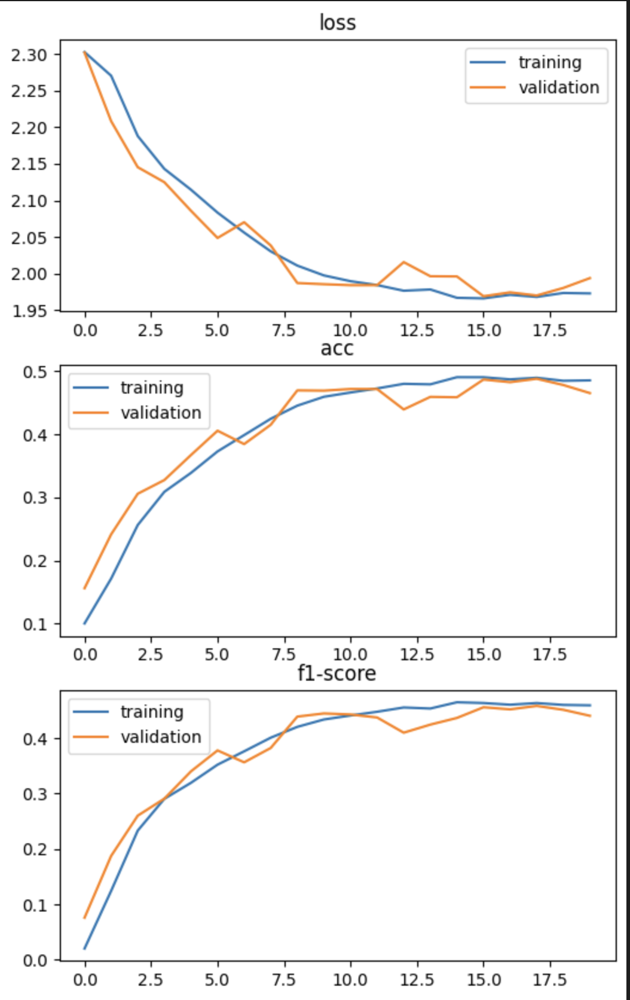
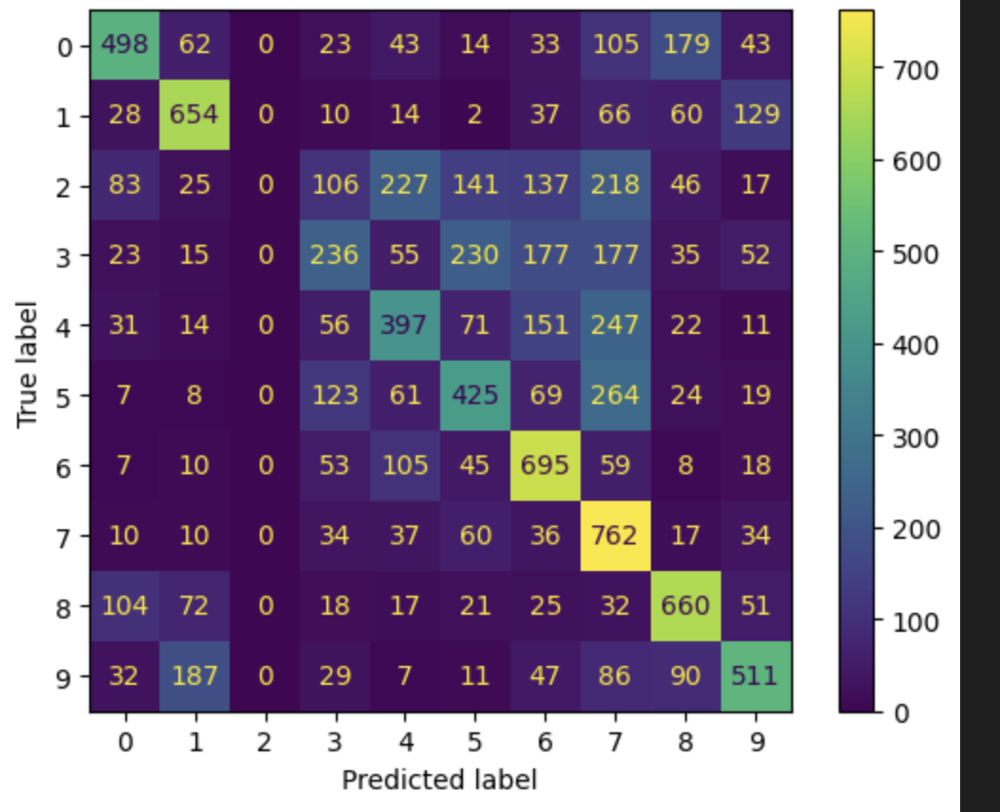
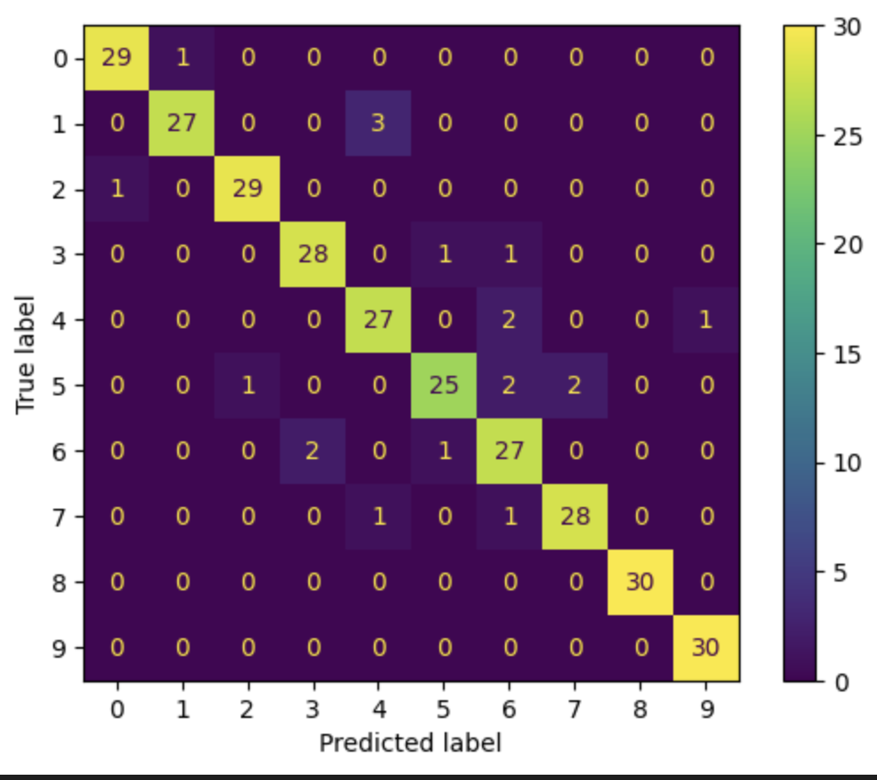

# Use case

## Table of Contents
1. [Image classification (via CNN)](#image-classification-via-cnn)
    1. [Setup](#setup)
    1. [Model arch.](#model-arch)
    1. [Training](#training)
    1. [Training result](#training-result)
    1. [Metrics](#metrics)
    1. [Evaluation (confusion matrix)](#evaluation-confusion-matrix)
1. [Text classification (via EfficientNet V2 S)](#text-classification-via-efficientnet-v2-s)
    1. [Setup](#setup-1)
    1. [Model arch.](#model-arch-1)
    1. [Training](#training-1)
    1. [Training result](#training-result-1)
    1. [Metrics](#metrics-1)
    1. [Evaluation (confusion matrix)](#evaluation-confusion-matrix-1)

## Image classification (via CNN)

### Setup
- Classify image in **CIFAR 10** dataset with **CNN** model
- Use **GPU** for training 
- **Input** : image in size (32, 32, 3)
- **Output** : 10 classes (0-9)
- Batch size is 32
- from 60,000 image splited into
    1. 40,000 of train
    1. 10,000 of validation
    1. 10,000 of test

### Model arch.
1. Conv2D (`nn.Conv2d(3, 6, 5)`)
    - input_channel = 3
    - output_channel = 6
    - kernel_size = (5, 5)
    - **parameters** = (5x5)x3x6 + 6 = 456
1. ReLU (`nn.ReLU()`)
1. MaxPool2D (`nn.MaxPool2d(2, 2)`)
    - kernal_size = (2, 2)
    - stride = 2
1. Conv2D (`nn.Conv2d(6, 16, 5)`)
    - input_channel = 6
    - output_channel = 16
    - kernel_size = (5, 5)
    - **parameters** = (5x5)x6x16 + 16 = 2,416
1. ReLU
1. MaxPool2D
    - kernal_size = (2, 2)
    - stride = 2
1. Flatten (`torch.flatten()`)
1. Dense (`nn.Linear(400, 120)`)
    - input = 400 (16x5x5)
    - output = 120
    - **parameters** = 400x120 + 120 = 48,120
1. ReLU
1. Dense (`nn.Linear(120, 84)`)
    - input = 120
    - output = 84
    - **parameters** = 120x84 + 84 = 10,164
1. ReLU
1. Dense (`nn.Linear(84, 10)`)
    - input = 84
    - output = 10
    - **parameters** = 84x10 + 10 = 850
1. Softmax (`nn.Softmax()`)

Total parameters = 456 + 2,416 + 48,120 + 10,164 + 850 = 61,006
```python
from torchinfo import summary
print(summary(model, input_size=(32, 3, 32, 32)))
```

### Training
- Loss(criterion) : `nn.CrossEntropyLoss()`
- Optimizer : `torch.optim.SGD(model.parameters(), lr=1e-2, momentum=0.9)`
- train steps
    >Let's train!
    >For an epoch in a range
    >Call model dot train
    >Do the forward pass
    >Calculate the loss
    >Optimizer zero grad
    >Lossssss backward
    >Optimizer step step step
    >
    >Test time!
    >Call model dot eval
    >With torch inference mode
    >Do the forward pass
    >Calculate the loss
    >
    >Print out what's happenin'
    >
    >Let's do it again 'gain 'gain
    
    choose the model by **validation loss**

### Training result


### Metrics
```python
report = classification_report(y_labels, y_pred)

acc = report['accuracy']
prec = report['weighted avg']['precision']
rec = report['weighted avg']['recall']
f1 = report['weighted avg']['f1-score']
```
- Accuracy
    - in **prediction**, how many **correct**
- Precision
    - in **prediction**, how many correct in **positive**
- Recall
    - in **positive**, how many correct in **prediction**
- F1
    - average of precision and recall

### Evaluation (confusion matrix)
```python
from sklearn.metrics import confusion_matrix, ConfusionMatrixDisplay

M = confusion_matrix(y_labels, y_pred)
disp = ConfusionMatrixDisplay(confusion_matrix=M)
```


##  Text classification (via EfficientNet V2 S)
### Setup
- Classify 10 classes in Animal image dataset using EfficientNet V2 model
- Use GPU for training
- Input : image in size (224, 224, 3)
    - (230, 230) -> random rotation, clop, horizontal flip, vertical flip, nomralize -> train
    - normalize -> test
- Output : 10 classes (0-9)
- Batch size is 32
- from 2,000 image splited into
    1. 1,400 of train
    1. 300 of validation
    1. 300 of test

### Model arch.
1. use pretrained weight from ImageNet-1000
    ```python
    import torchvision
    pretrained_weight = torchvision.models.EfficientNet_V2_S_Weights.IMAGENET1K_V1
    ```
1. use EfficientNet V2 size S
    ```python
    model = torchvision.models.efficientnet_v2_s(weights = pretrained_weight)
    model.classifier[1] = nn.Linear(1280, 10)
    model.to(device)
    ```

Total parameters = 20,190,298 

### Training
- criterion : `nn.CrossEntropyLoss()`
- optimizer : `torch.optim.SGD(model.parameters(), lr=1e-2, momentum=0.9)`
- scheduler : `torch.optim.lr_scheduler.StepLR(optimizer, step_size=7, gamma=0.5)`

### Training result


### Metrics
- Accuracy
- Precision
- Recall
- F1

### Evaluation (confusion matrix)

